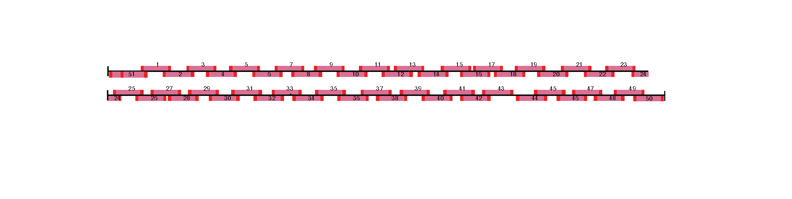
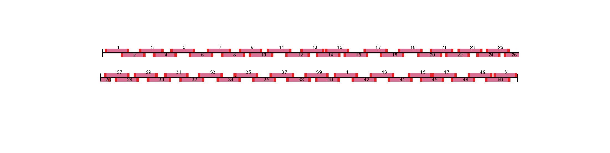

RSV Tiled Amplicon Sequencing 
--

A protocol for RSV-A and RSV-B sequencing that consists of two pools of overlapping amplicons. The amplicons are ~400bp long and are compatible with Illumina and Nanopore sequencing. Its designed to work with current Artic SARS-CoV-2 protocols. 

### RSV-A
- Uses hRSV/A/England/397/2017 as the reference (EPI_ISL_412866 on GISAID and PP109421.1 on Genbank). 
- Consists of 51 primer pairs.
- Amplicon 51 has alternative forward primers, and is not ~400 bp long. The first forward primer creates an amplicon that is ~580 bp long and the second primer creates an amplicon that is ~300 bp in length. This is something to keep in mind if filtering on read length for ONT sequencing. 

 

### RSV-B
- Uses hRSV/B/Australia/VIC-RCH056/2019  as the reference (EPI_ISL_1653999 on GISAID and OP975389 on Genbank). 
- consists of 51 primer pairs, with all odd numbered pairs in pool 1 and even numbered primers in pool 2

 
